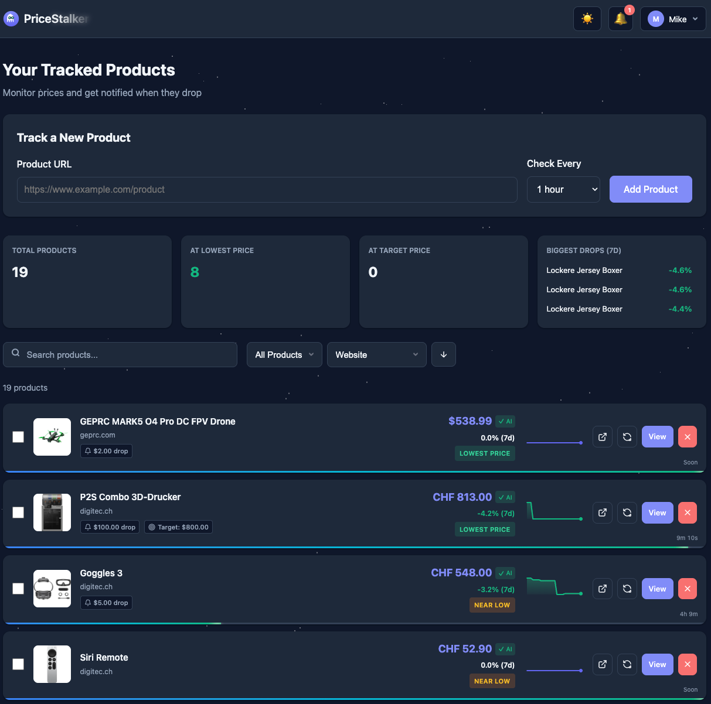
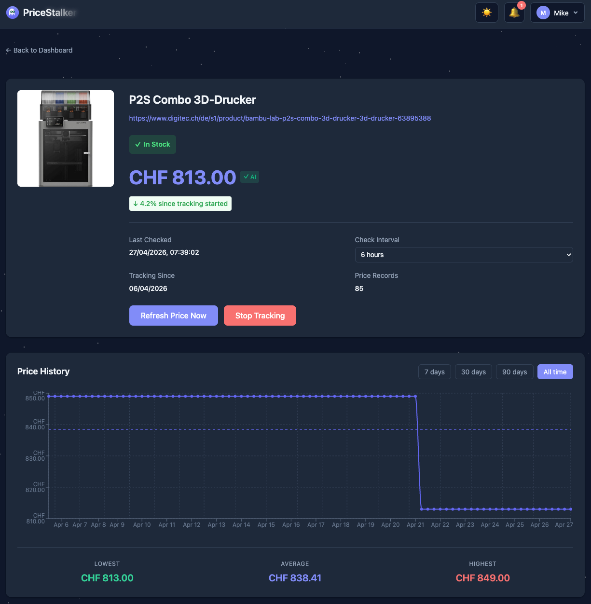

<p align="center">
  
</p>

<p align="center">
  <strong>We stalk prices so you don't have to.</strong><br>
  Self-hosted price tracking that watches product pages across the web and
  tells you when a price drops, hits your target, or an out-of-stock item
  comes back.
</p>

<p align="center">
  <a href="https://github.com/mikeknight85/PriceStalker/releases"></a>
  <a href="LICENSE"></a>
  <a href="https://github.com/mikeknight85/PriceStalker/pkgs/container/pricestalker-backend"></a>
</p>

<p align="center">
  
  &nbsp;
  
</p>

---

## About this fork

PriceStalker is a friendly fork of
[clucraft/PriceGhost](https://github.com/clucraft/PriceGhost), which has been
inactive since early 2026. Full credit to [@clucraft](https://github.com/clucraft)
for the original work — upstream commits are preserved in this repo's history
and the MIT license is intact.

**2.0 is a substantial rebuild.** The application was rebuilt on a
heavily-reworked branch of the same upstream, contributed by a collaborator, and
brings a far more capable scraping engine, per-retailer configuration, live
currency conversion, and an optional stealth-browser service. The 1.x identity
layer (OIDC/SSO) and release engineering were carried forward. See
[Upgrading to 2.0](#upgrading-to-20) — the upgrade migrates your schema
automatically and is one-way, so take a backup first.

**Already running PriceGhost?** See [Migrating from PriceGhost](#migrating-from-priceghost)
— you can attach this fork to your existing database and volume without
moving any data.

---

## You choose the price. Always.

Most price trackers silently pick a number off the page and hope for the best.
PriceStalker runs **four independent extraction methods** in parallel and lets
them vote:

| Method | How it works | Reliability |
|--------|--------------|-------------|
| **JSON-LD** | Reads `schema.org` structured data embedded by the retailer | Highest |
| **Site-specific** | Custom-tuned scrapers for Amazon, Best Buy, Walmart, Target, Costco, eBay, Newegg, Home Depot, AliExpress, Magento 2 | High |
| **Generic CSS** | Intelligent selectors that find price patterns on any site | Medium |
| **AI analysis** | Claude / GPT / Gemini / Vertex / Groq / DeepSeek / Mistral / Ollama analyzes the page context | High |

When methods agree, you're set. When they disagree, the **Price Selection
Modal** shows every candidate with confidence scores and context — you pick.
No more accidentally tracking:

- `Save $200` discount amounts instead of the actual price
- `$49/mo` financing plans instead of the real $1,999 price
- Bundle prices when you wanted the single item
- A "suggested retail" strike-through instead of the live price

---

## What's new in this fork

| Version | Highlights |
|---------|-----------|
| **2.0.0-beta** | **Rebuilt scraping engine** — acquisition/transport/extraction split with consensus arbitration and DOM denoising. **Per-retailer configuration UI** — tune selectors, stock phrases, user-agent and engine per domain, with a visual selector picker. **Optional remote scraper** — stealth browser in its own container for sites that block ordinary scraping. **Live currency conversion** with daily FX rates and per-user preferred currency. **Product categories**, dashboard tabs, pagination and filtering. **Email/SMTP notifications** and per-channel message templates. **Product search** via SearXNG. **Persisted system logs** with an admin viewer, and **system API tokens** for machine access. Schema migrations now run automatically at startup. |
| **1.4.x** | **Edit a watcher's price selection** after creation — re-pick the price/selector without losing price history (#21). Relative product image URLs now resolved to absolute so images stop breaking (#22). |
| **1.3.x** | **Custom Webhook** notification provider (any HTTP endpoint). **`:beta` Docker channel** + BETA pill in Settings. Shopify-aware extraction (`/products/<handle>.js`). Per-product currency override + "Detected via …" hint. Any-price-change alert (#5). Self-healing product images. In-app update notification. Themed textareas + UI polish. |
| **1.1.2** | New logo (ghost with binoculars). `/version.json` caching hardened. |
| **1.1.1** | Fix version display stuck at 1.0.6 post-release. |
| **1.1.0** | Rebrand to PriceStalker. **Groq** and **OpenRouter** AI providers. Multi-currency parser fixes (BRL, Swiss apostrophe, EUR thousands-only). Base image bumped to Node 22 LTS. Default insecure port mappings removed. Migration path from upstream PriceGhost. |

Full history in [CHANGELOG.md](CHANGELOG.md).

---

## Features

### Multi-strategy price extraction
- Four independent extractors vote on the correct price
- Price Selection Modal with candidates, confidence scores, and context
- Puppeteer + stealth plugin for JavaScript-heavy sites (Best Buy, Target, Walmart)
- AI arbitration when methods disagree

### Price tracking
- Universal scraping across any e-commerce site (with AI fallback)
- AI price verification catches `$189 off` scraped as `$189`
- Interactive price history charts (7d / 30d / 90d / all time)
- 7-day sparklines on the dashboard
- Configurable check intervals (5 min to 24 h per product)
- Live countdown timers + progress bars to the next check

### Multi-currency
- USD, EUR, GBP, CHF, CAD, AUD, JPY, INR, BRL, PLN, SEK, NOK, DKK, KRW, RUB, CNY
- Currency-aware number parsing: `R$2.720,00` → 2720 BRL (not 2.72); `CHF 1'234.56` with Swiss apostrophe; `€1.234,56` with European thousands
- **Live conversion (2.0)** — daily FX rates, a per-user preferred currency, and prices shown in it regardless of what the retailer quoted
- Display formatter centralised — notifications, charts, tables all speak the same currency

### Notifications
Telegram · Discord · Pushover · ntfy.sh (self-hosted supported) · Gotify · **Email/SMTP (2.0)** · **Custom Webhook** (any HTTP endpoint — Apprise, Home Assistant, n8n, Zapier, your own backend) · per-channel toggles · **customisable message templates per channel (2.0)** · test buttons for every provider.

- **Price drop alerts** — set a CHF/USD/EUR threshold
- **Target price alerts** — get notified when a specific price is reached
- **Any-change alerts** — fire on every price movement (up or down), useful for a complete log
- **Back-in-stock alerts** — know when out-of-stock items return

### Stock tracking
Automatic out-of-stock detection, visual badges, stock-change history timeline per product, notifications when items come back.

### User experience
PWA installable on mobile · dark/light/auto theme · responsive design · toast notifications · real-time countdowns · manual refresh · per-product pause.

### Organising your watchers (2.0)
Product categories with a sidebar filter · dashboard tabs · pagination and sorting · multiple price types per product (standard, deal, member, pre-order) · product search by name via SearXNG.

### Retailer configuration (2.0)
Per-domain scraping control in **Admin → Retailers**: selector sets for price, name, image and stock; in-stock / out-of-stock / pre-order phrase lists; JSON-LD key mapping; custom user-agent and referrer; proxy, browser or remote-scraper engine choice; and a visual selector picker that runs against the live page. Retailer status and history are tracked so you can see what is failing.

### Operations (2.0)
Persisted system logs with an admin viewer and search · system API tokens for machine/CLI access · database health monitoring with optional SMTP alerting · disable a user without deleting them.

### User management
Multi-user with per-user products and settings · admin panel · registration toggle · profile / password changes · **OIDC/SSO** with just-in-time provisioning, account linking by email, and a configurable sign-in policy (**Admin → Authentication**).

---

## AI providers

Eight providers supported. AI extraction kicks in when standard scrapers fail;
AI verification catches bad extractions; AI arbitration breaks ties.

| Provider | Get a key | Recommended model | Cost |
|----------|-----------|-------------------|------|
| **Anthropic (Claude)** | [console.anthropic.com](https://console.anthropic.com) | Claude Haiku 4.5 ⭐ | ~$0.001 / check |
| **OpenAI (GPT)** | [platform.openai.com](https://platform.openai.com/api-keys) | GPT-4.1 Nano | ~$0.001 / check |
| **Google Gemini** | [aistudio.google.com](https://aistudio.google.com/apikey) | Gemini 2.5 Flash Lite | Free tier available |
| **Google Vertex AI** | [console.cloud.google.com](https://console.cloud.google.com) | Gemini via Vertex | GCP billing |
| **Groq** | [console.groq.com](https://console.groq.com/keys) | Llama 3.3 70B Versatile | **Free tier** |
| **DeepSeek** | [platform.deepseek.com](https://platform.deepseek.com) | `deepseek-chat` | Low cost |
| **Mistral** | [console.mistral.ai](https://console.mistral.ai) | `mistral-large-latest` | Paid |
| **Ollama (local)** | [ollama.ai](https://ollama.ai) | `ollama pull qwen3` | **Free**, local compute |

Configured in **Admin → AI Engine**. AI settings are instance-wide in 2.0 —
1.x stored an API key per user; 2.0 has one admin-managed configuration for the
whole instance. Start with AI Verification: it's the highest-leverage single
setting and catches the most embarrassing extraction errors.

> **Removed in 2.0:** OpenRouter. If you relied on it, stay on 1.4.x or use
> Groq, which also has a free tier.

---

## Supported retailers

Site-specific scrapers (higher reliability than generic extraction):

Amazon (all locales) · Best Buy · Walmart · Target · Costco · eBay · Newegg · Home Depot · AliExpress · Any Magento 2 store

**Every other site** works via generic extraction + AI fallback. Tested
extensively with European retailers (digitec.ch, galaxus.de, mediamarkt.*,
etc.); they work via the AI path.

---

## Quick start

### Docker (recommended)

```bash
git clone https://github.com/mikeknight85/PriceStalker.git
cd PriceStalker
cp .env.example .env
$EDITOR .env                      # set POSTGRES_PASSWORD and JWT_SECRET
docker compose up -d
```

Access at <http://localhost>. Create your first account, add a product URL, done.

`POSTGRES_PASSWORD` and `JWT_SECRET` are **required** — the stack refuses to
start without them rather than falling back to a built-in default, which would
mean every deployment shared one database password and one session-signing key.
Generate a secret with `openssl rand -base64 48`.

The optional stealth scraper (see [Remote scraper](#remote-scraper)) is off by
default:

```bash
docker compose --profile remotescraper up -d
```

### Remote scraper

Some retailers block ordinary scraping. 2.0 can offload those pages to a
separate container running a stealth browser with a pooled, recycled Chromium
instance. The backend scrapes in-process without it, so it is entirely optional.

Once running, set the URL in **Admin → System → Network & Integration** to
`http://remotescraper:5100/scrape`, then enable it per domain in
**Admin → Retailers**.

### Upgrading to 2.0

**Take a database backup first. The upgrade is one-way.**

```bash
docker compose exec postgres \
  pg_dump -U postgres --no-owner --no-privileges priceghost | gzip > backup.sql.gz
```

Then pull the new images and start. Schema migrations run automatically when
the backend boots — it waits for the database, applies what is pending, and
only then starts serving. A first boot on a large database takes longer than
usual for that reason.

What the migration does to your data:

- Products, price history and stock history carry over unchanged.
- `notification_history` is converted into the new in-app notification model
  and then **dropped**. Anything you had already cleared arrives read; the rest
  arrives unread. The original payloads are preserved in each notification's
  `data` column.
- Each user's preferred currency is derived from the currency they have most
  often recorded, rather than defaulting everyone to one value.
- Per-user AI credentials are **not** migrated — 2.0 manages AI centrally, so
  an admin re-enters the key once under **Admin → AI Engine**.
- SSO users keep their linked identity; `password_hash` becomes nullable to
  allow accounts that have no password.

**Log out and back in afterwards.** The frontend caches your user object at
sign-in, so a session that spans the upgrade keeps the one 1.x issued — which
shows up as a missing Admin entry in the user dropdown.

There is no down migration. Rolling back means restoring the backup.

### Migrating from PriceGhost

If you're running [clucraft/PriceGhost](https://github.com/clucraft/PriceGhost)
and want to switch without losing data, set these in `.env`:

```env
POSTGRES_DB=priceghost
POSTGRES_VOLUME_NAME=priceghost_postgres_data
```

Then swap your image references from `ghcr.io/clucraft/priceghost-*` to
`ghcr.io/mikeknight85/pricestalker-*`. Missing columns are added automatically
on first boot. The same backup advice applies.

See [.env.example](.env.example) for all available overrides.

### Image channels

Three rolling tags are published, in order of stability:

| Tag | When it updates | Use for |
|-----|-----------------|---------|
| `:latest` | Every tagged release (`vX.Y.Z`) | Production. Sticks until the next release. |
| `:1.2` | Same as `:latest`, but only within the 1.2.x line | Production with auto-patch but no minor bumps. |
| `:beta` | Every merge to `main` | Pre-release / staging instances. May break. |

Pin to an immutable version for absolute stability:

```yaml
image: ghcr.io/mikeknight85/pricestalker-backend:1.2.11
image: ghcr.io/mikeknight85/pricestalker-frontend:1.2.11
```

---

## Development setup

Development requires Node 24.x (at least 24.18), npm 11.x (at least 11.16),
and PostgreSQL 14+. [Volta](https://volta.sh/) automatically selects the
project's pinned Node and npm versions.

For local development, setup, operating-system requirements, container and
hot-reload workflows, and verification commands, see
[CONTRIBUTING.md](CONTRIBUTING.md).

---

## Configuration

### Notifications

<details><summary><b>Telegram</b></summary>

1. Create a bot via [@BotFather](https://t.me/botfather) on Telegram
2. Get your Chat ID from [@userinfobot](https://t.me/userinfobot)
3. Enter both in Settings → Notifications
</details>

<details><summary><b>Discord</b></summary>

1. Server Settings → Integrations → Webhooks → New Webhook
2. Copy the URL, paste it in Settings → Notifications
</details>

<details><summary><b>Pushover</b></summary>

1. Create an account at [pushover.net](https://pushover.net)
2. Note your User Key, create an application at [pushover.net/apps](https://pushover.net/apps/build) to get an API Token
3. Enter both in Settings → Notifications
</details>

<details><summary><b>ntfy.sh</b></summary>

1. Pick a unique topic (e.g. `pricestalker-yourname-abc123`)
2. Subscribe on your phone via the [ntfy app](https://ntfy.sh/app) or <https://ntfy.sh/your-topic-name>
3. Enter the topic in Settings → Notifications. Self-hosted ntfy is also supported — set the server URL + optional username/password.
</details>

<details><summary><b>Gotify (self-hosted)</b></summary>

1. Deploy [Gotify](https://gotify.net/docs/install)
2. Create an application in Gotify to get an App Token
3. Enter server URL + App Token in Settings → Notifications; use "Test Connection" before saving.
</details>

<details><summary><b>Custom Webhook</b> (Apprise, Home Assistant, n8n, Zapier, custom services)</summary>

For everything that isn't one of the providers above. Settings → Notifications → Custom Webhook.

Configure:
- **URL** of the receiver
- **HTTP method** — `GET` / `POST` / `PUT` / `PATCH` / `DELETE`
- **Headers** — optional JSON object of header → value (e.g. `{"Authorization": "Bearer ..."}`); `Content-Type` defaults to `application/json` for non-GET when not set
- **Body template** — optional. Leave blank to send a sensible JSON default. Tokens in `{braces}` are substituted at send time:

| Token | Meaning |
|-------|---------|
| `{title}` | Product name |
| `{type}` | `price_drop` · `price_change` · `target_price` · `back_in_stock` |
| `{url}` | Product URL |
| `{currency}` | ISO currency code |
| `{price}` / `{new_price}` | Current price |
| `{old_price}` | Previous price (when applicable) |
| `{threshold}` | Configured drop threshold |
| `{target_price}` | Configured target price |
| `{timestamp}` | ISO-8601 send time |

Hit **Send Test** to fire the configured template against a stub payload. `webhook.site` is the quickest receiver for first-time testing.
</details>

### AI

Any of the eight providers listed above, configured instance-wide in
**Admin → AI Engine**. Recommended bootstrap:

1. Start with **Groq** — free tier, no credit card to start
2. For production quality, **Claude Haiku 4.5** via Anthropic
3. For zero-cost + offline, **Ollama** with `qwen3` locally

---

## Tech stack

| Layer | Tech |
|-------|------|
| Frontend | React 19, TypeScript, Vite, Recharts |
| Backend | Node.js 24, Express, TypeScript, umzug migrations |
| Database | PostgreSQL 16 |
| Scraping | Cheerio, Puppeteer (stealth + adblock), optional remote scraper service |
| AI | Anthropic, OpenAI, Gemini, Vertex, Groq, DeepSeek, Mistral, Ollama |
| Auth | JWT + bcrypt, optional OIDC/SSO |
| Scheduling | node-cron |
| Deploy | Docker Compose / Docker Swarm |

---

## API reference

Base URL: `/api`. All endpoints require `Authorization: Bearer <jwt>` except `/auth/*`.

<details><summary><b>Authentication</b></summary>

| Method | Endpoint | Description |
|--------|----------|-------------|
| `POST` | `/auth/register` | Create account |
| `POST` | `/auth/login` | Login, returns JWT |
| `GET` | `/auth/registration-status` | Check if registration is enabled |
</details>

<details><summary><b>Products</b></summary>

| Method | Endpoint | Description |
|--------|----------|-------------|
| `GET` | `/products` | List tracked products |
| `POST` | `/products` | Add product by URL |
| `GET` | `/products/:id` | Product details + stats |
| `PUT` | `/products/:id` | Update settings/notifications |
| `DELETE` | `/products/:id` | Stop tracking |
| `GET` | `/products/:id/prices` | Price history |
| `POST` | `/products/:id/refresh` | Force immediate check |
</details>

<details><summary><b>Settings</b></summary>

| Method | Endpoint | Description |
|--------|----------|-------------|
| `GET`/`PUT` | `/settings/notifications` | Notification config |
| `POST` | `/settings/notifications/test/{telegram,discord,pushover,ntfy,gotify}` | Send a test notification |
| `POST` | `/settings/notifications/test-gotify` | Test Gotify connection before saving |
| `GET`/`PUT` | `/settings/ai` | AI extraction settings |
| `POST` | `/settings/ai/test` | Test AI extraction on a URL |
| `POST` | `/settings/ai/test-{ollama,gemini,groq,openrouter}` | Test a specific AI provider connection |
</details>

<details><summary><b>Profile & Admin</b></summary>

| Method | Endpoint | Description |
|--------|----------|-------------|
| `GET`/`PUT` | `/profile` | Get / update user profile |
| `PUT` | `/profile/password` | Change password |
| `GET`/`POST` | `/admin/users` | List / create users (admin only) |
| `DELETE` | `/admin/users/:id` | Delete user |
| `PUT` | `/admin/users/:id/admin` | Toggle admin status |
| `GET`/`PUT` | `/admin/settings` | System settings |
</details>

---

## Project structure

```
PriceStalker/
├── backend/
│   └── src/
│       ├── config/         # Database connection, init
│       ├── middleware/     # JWT authentication
│       ├── models/         # Database queries
│       ├── routes/         # API endpoints
│       ├── services/       # Scraper, AI extractors, scheduler, notifications
│       └── utils/          # Currency-aware price parser
├── frontend/
│   └── src/
│       ├── api/            # Axios client + types
│       ├── components/     # Reusable UI (PriceSelectionModal, PriceChart, …)
│       ├── context/        # Auth & Toast contexts
│       └── pages/          # Route-level screens
├── database/
│   └── init.sql            # Schema + idempotent column migrations
├── .env.example            # Including the PriceGhost migration block
└── docker-compose.yml
```

---

## Update check & privacy

**No telemetry, no analytics, no phone-home.** PriceStalker transmits nothing
about your deployment, users, or products.

1.x checked GitHub once a day for a newer release and showed a dismissible
banner. **That check is not present in 2.0** — watch
[Releases](https://github.com/mikeknight85/PriceStalker/releases) instead. It
may return in a later 2.x; `DISABLE_UPDATE_CHECK` currently does nothing.

---

## Rate limiting & retailer etiquette

Don't get banned:

- **Staggered checks** — products are scheduled with ±5 min jitter
- **Request delays** — 2–5 s random delay between different products
- **Reasonable intervals** — default 1 h; go longer if you track many items
- **Browser-like headers** — standard User-Agent strings, not a scraper fingerprint
- **UI warning** when intervals get aggressive (< 5 min)

---

## License

MIT — see [LICENSE](LICENSE). Original copyright to @clucraft (PriceGhost),
additional changes copyright to contributors to this fork.

---

## Star history

<a href="https://star-history.com/#mikeknight85/PriceStalker&Date">
  <picture>
    <source media="(prefers-color-scheme: dark)" srcset="https://api.star-history.com/svg?repos=mikeknight85/PriceStalker&type=Date&theme=dark" />
    <source media="(prefers-color-scheme: light)" srcset="https://api.star-history.com/svg?repos=mikeknight85/PriceStalker&type=Date" />
    
  </picture>
</a>
