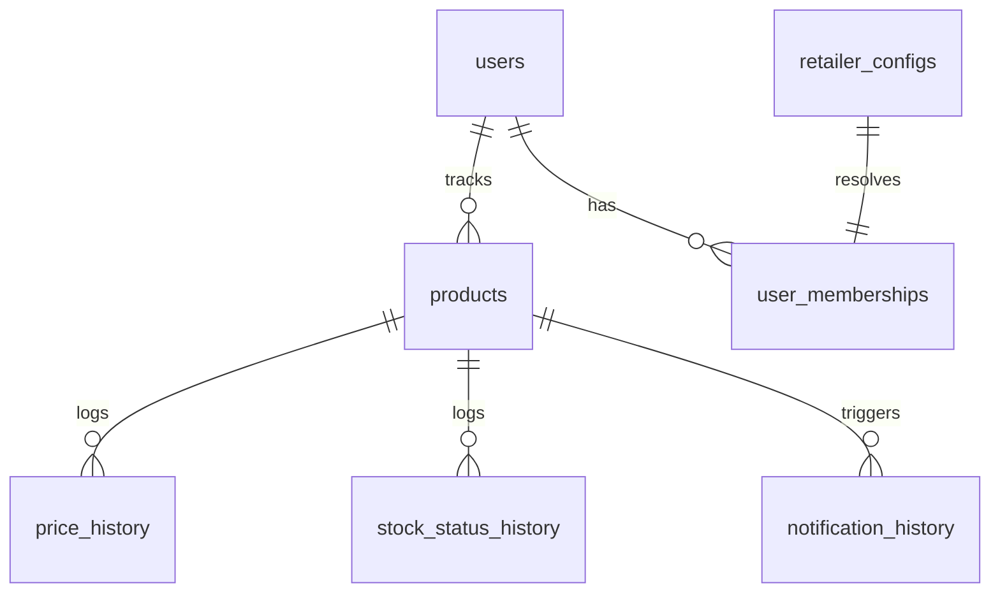

# PriceStalker Database Documentation

> **Provenance:** adapted from the upstream engine docs (shared scraper core). Infra specifics removed; logic matches this repo. Verify against code — docs can drift.


This document describes the PostgreSQL database schema, core entity tables, trigger-based cache synchronization, and backup/migration procedures used in PriceStalker.

---

## Schema Overview

PriceStalker uses **PostgreSQL** as its absolute source of truth. All domain configuration (retailer selectors, regex patterns, anti-bot rules) and application states (product lists, price history, notification templates) are stored here.



---

## Core Tables

### 1. `users`
Stores user profile information, authentication hashes, locale/currency settings, and integration details for notification providers.
* **Key Fields**:
 - `email` (unique) & `password_hash`
 - `is_admin`: Grants access to backend administrative endpoints.
 - `preferred_currency` & `locale` (defaults to `AUD` and `en-AU`).
 - **Notification Integrations**: Stores activation state, webhook tokens, and customizable templates for `telegram`, `discord`, `pushover`, `ntfy`, `gotify`, `webhook`, and `email`.
 - **AI Model Keys**: Encapsulates keys/models configuration for `anthropic`, `openai`, `gemini`, and `ollama`.

### 2. `products`
The central registry of tracked items across all users.
* **Key Fields**:
 - `url` & `name`
 - `refresh_interval`: Frequency (seconds) for scheduled checks.
 - `stock_status`: Current availability (e.g., `in_stock`, `out_of_stock`, `pre_order`).
 - `price_drop_threshold` & `target_price`: Alert targets.
 - `preferred_extraction_method`: Stores the user's selected consensus winning extraction type (FE-15 integration).
 - `anchor_price`: Benchmark price used to detect anomalous consensus pricing drift.
 - `needs_price_review`: Boolean flag indicating manual verification required.

### 3. `retailer_configs`
Houses the extraction selectors and custom routing rules. **Strictly no retailer logic is hardcoded in backend services.**
* **Key Fields**:
 - `domain` (unique primary lookup key, e.g. `jbhifi.com.au`).
 - `use_remote_scraper`: Forces offloading browser-rendering requests to the `remotescraper` service.
 - `is_js_heavy`: Flags Puppeteer usage for JS-heavy elements.
 - `currency_hint`: Default fallback currency for parser.
 - **JSONB Arrays**: Standardized selectors for `name_selectors`, `price_selectors`, `deal_price_selectors`, `member_price_selectors`, `image_selectors`, `stock_selectors`, `pre_order_price_selectors`.
 - `user_agent` & `referrer`: Request headers configuration overrides.

### 4. `price_history`
Chronological record of price checks, used to render sparkline charts and historical drop graphs.
* **Key Fields**:
 - `product_id` (foreign key with cascade delete).
 - `price` & `currency`
 - `price_type`: Tracks extraction categories (`standard`, `deal`, `member`, `pre-order`).

### 5. `stock_status_history`
Chronological record of availability changes, used to render the 30-day stock status timeline.
* **Key Fields**:
 - `product_id` (foreign key).
 - `status`: E.g. `in_stock`, `out_of_stock`, `pre_order`.

### 6. `exchange_rates`
Stores conversion exchange rates synchronized daily at 4:00 AM.
* **Key Fields**:
 - `from_currency`, `to_currency`
 - `rate`: Conversion ratio.

---

## Trigger-Based Cache Invalidation

To maintain database performance under heavy scraping loads, the backend maintains system settings and retailer selectors in memory (`SettingsCache` and `RetailerConfigCache`).

To prevent cache staleness when settings are edited in the Admin Portal:
1. PostgreSQL triggers are installed on `system_settings` and `retailer_configs` tables.
2. Upon any `INSERT`, `UPDATE`, or `DELETE` operation, a trigger function runs and fires a `pg_notify` event:
 ```sql
 NOTIFY settings_update;
 ```
3. The backend listens for this channel and instantly clears the local caching layer (`settingsCache.clear()`), ensuring real-time UI changes propagate to the background scraper without restarts.

---

## Operations

### 1. Migrations
Migrations are stored under `backend/src/migrations/` and run sequentially using the Umzug migrations runner.
* **Run Migrations (Production)**:
 ```bash
 pnpm --filter pricestalker-backend run db:migrate
 ```
* **Run Migrations (Development)**:
 ```bash
 pnpm --filter pricestalker-backend run db:migrate:dev
 ```

### 2. Database Backup

Take a backup before any production deploy — migrations are one-way. On the
Swarm host:

```bash
docker exec $(docker ps -q -f name=pricestalker_postgres) \
 pg_dump -U postgres --no-owner --no-privileges priceghost | gzip > backup.sql.gz
```

See `deploy/swarm-stack.yml` for the production stack.
