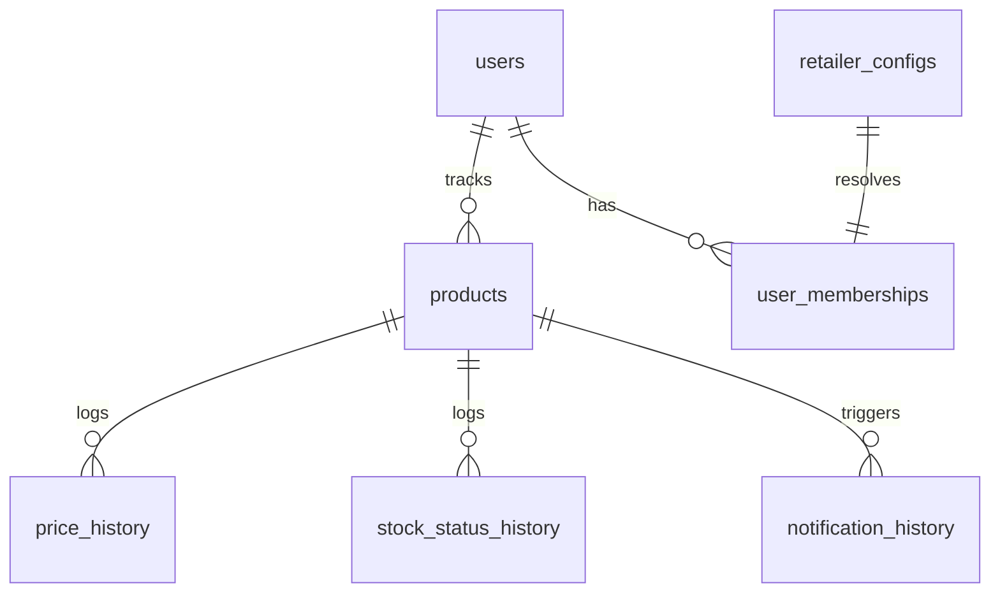

# PriceStalker Database Documentation

> **Provenance:** adapted from the upstream engine docs (shared scraper core). Infra specifics removed; logic matches this repo. Verify against code — docs can drift.


This document describes the PostgreSQL database schema, core entity tables, trigger-based cache synchronization, and backup/migration procedures used in PriceStalker.

---

## Schema Overview

PriceStalker uses **PostgreSQL** as its absolute source of truth. All domain configuration (retailer selectors, regex patterns, anti-bot rules) and application states (product lists, price history, notification templates) are stored here.



---

## Core Tables

### 1. `users`
Stores user profile information, authentication hashes, locale/currency settings, and integration details for notification providers.
* **Key Fields**:
 - `email` (unique) & `password_hash`
 - `is_admin`: Grants access to backend administrative endpoints.
 - `disabled`: Boolean flag to disable access without deleting the account.
 - `last_active` & `created_at`: Timestamps tracking user activity and registration.
 - `currency` & `locale` are optional display preferences. A null locale uses
   the browser format and a null currency leaves prices in the retailer's
   original currency.
 - **Notification Integrations**: Stores activation state, webhook tokens, and customizable templates for `telegram`, `discord`, `pushover`, `ntfy`, `gotify`, `webhook`, and `email`.
 - *(Note: AI provider settings and API keys are stored instance-wide in `system_settings`, not in `users`)*.

### 2. `products`
One retailer's listing of something: a URL, its own schedule, its own scrape and
price history. **Not** the thing the user is tracking — that is `items`, below,
and every product belongs to exactly one.
* **Key Fields**:
 - `url` & `name`
 - `item_id`: The canonical item this listing belongs to. Never null in practice.
 - `is_primary`: Whether this listing supplies the item's identity. At most one
   per item, enforced by the partial unique index `products_one_primary_per_item`.
 - `refresh_interval`: Frequency (seconds) for scheduled checks.
 - `next_check_at`: When the scheduler will next pick it up. Bounded at 1.5x
   `refresh_interval`; see `utils/system/scheduler-helpers.ts`.
 - `stock_status`: Current availability (`in_stock`, `out_of_stock`, `pre_order`, `member_only`, `not_available`, `unknown`).
 - `unavailable_reason`: Specific explanation when a page cannot be reached. See `types/availability.ts` for the codes.
 - `page_gone_streak`: Consecutive *definitive* failures (404/410/soft-404), used to de-bounce before marking a product unavailable.
 - `failure_streak` & `last_failure_at`: Consecutive *transient* failures (timeout, DNS, bot challenge). Tracked separately because a transient failure is evidence about the network, not about the product, and never pauses monitoring.
 - `checking_paused` & `auto_paused`: Whether monitoring is stopped, and whether the system stopped it rather than the user. The system only resumes what the system paused.
 - `preferred_extraction_method`: Stores the winning consensus extraction type.
 - `anchor_price`: Benchmark price used to detect anomalous consensus pricing drift.
 - `needs_price_review`: Boolean flag indicating manual verification required.
* **Dead columns, do not read**: `target_price`, `price_drop_threshold` and
  `notify_back_in_stock` still exist here but moved to `items` in migration 020.
  They are retained only so that migration can be rolled back, and a later
  migration drops them. Reading them yields whatever they held before the move.

### 2a. `items`
The canonical thing a user wants to buy, which may be sold by several
retailers. Introduced by migration `020_canonical_items` (issue #143), which
renamed the previously unused `product_groups`.

A product tracked at a single retailer is an item with one listing — grouping is
not optional, so that alert settings have exactly one home rather than living on
two tables with a rule about which wins.

**Naming**: the UI says "Product" for an item and "Store" for a listing, because
that is how people think about it. The database says `items` and `products`
because those are unambiguous to read. The mismatch is deliberate — see CLAUDE.md.

* **Key Fields**:
 - `name`, `image_url`, `category`: How the item is displayed. Seeded from the primary listing.
 - `user_id`: Owner. `ON DELETE CASCADE` from `users`.
 - `target_price`, `price_drop_threshold`, `notify_back_in_stock`: Alert settings.
   These describe intent about the thing ("tell me when anyone has this under
   50"), not about one shop's page, which is why they live here.
* **Constraints**: `products.item_id` references this `ON DELETE SET NULL`, so
  deleting an item ungroups its listings rather than destroying their history.
  `idx_products_item_id` supports fetching every listing for an item.
* **Reading a product's alert settings**: join through
  `ITEM_ALERT_COLUMNS` / `ITEM_ALERT_JOIN` and map rows with
  `withItemAlertSettings` (`repositories/item-alert-settings.ts`). The aliases
  exist because selecting `i.target_price` beside `p.*` yields two columns of the
  same name, and which one the driver keeps is undocumented.

### 3. `retailer_configs`
Houses the extraction selectors and custom routing rules. **Strictly no retailer logic is hardcoded in backend services.**
* **Key Fields**:
 - `domain` (unique primary lookup key, e.g. `amazon.com.au`).
 - `use_browser_scraper`: Offloads page rendering to the `scraper` service.
 - `currency_hint`: Default fallback currency for parser.
 - **JSONB Arrays**: Standardized selectors for `name_selectors`, `retailer_name_selectors`, `price_selectors`, `deal_price_selectors`, `member_price_selectors`, `pre_order_price_selectors`, `original_price_selectors`, `image_selectors`, `stock_selectors`, `exclusion_selectors`.
 - `in_stock_phrases`, `out_of_stock_phrases`, `pre_order_phrases`, `member_only_phrases`: Evaluated availability phrases.
 - `prefer_jsonld_image`: Tri-state override for JSON-LD images (`true`, `false`, `null` to inherit global).
 - `user_agent` & `referrer`: Request header overrides.

### 4. `price_history`
Chronological record of price checks, used to render sparkline charts and historical drop graphs.
* **Key Fields**:
 - `product_id` (foreign key with cascade delete).
 - `price` & `currency`
 - `price_type`: Tracks extraction categories (`standard`, `deal`, `member`, `pre_order`).

### 5. `stock_status_history`
Chronological record of availability changes, used to render the 30-day stock status timeline.
* **Key Fields**:
 - `product_id` (foreign key with cascade delete).
 - `status`: E.g. `in_stock`, `out_of_stock`, `pre_order`.

### 6. `notifications`
Stores generated alert records and delivery status.
* **Key Fields**:
 - `user_id` & `product_id`.
 - `type` / `event_type`: Event type (`price_drop`, `target_price`, `back_in_stock`, `price_announced`, `unavailable`, `resumed`).
 - `title`, `message`, `data` (structured event payload), `is_read`.

### 7. `system_settings`
Global instance configuration managed via Admin.
* **Key Fields**:
 - `key` (primary key, e.g. `ai_provider`, `remote_scraper_url`, `generic_*` selectors).
 - `value`: Stored setting or JSON string.

### 8. `system_api_tokens`
API access tokens for machine authorization.
* **Key Fields**:
 - `token`: Hashed bearer token (prefixed with `ps_`).
 - `user_id`: Owning user account.

### 9. `password_reset_tokens`
Short-lived tokens for self-service password reset.
* **Key Fields**:
 - `token_hash`, `user_id`, `expires_at`, `used_at`.

### 10. `system_logs`
Structured event log storage for system and scrape tracing.
* **Key Fields**:
 - `level` (`info`, `warn`, `error`, `debug`), `context`, `message`, `details` (JSONB), `created_at`.

---

## Trigger-Based Cache Invalidation

To maintain database performance under heavy scraping loads, the backend maintains system settings and retailer selectors in memory (`SettingsCache` and `RetailerConfigCache`).

To prevent cache staleness when settings are edited in the Admin Portal:
1. PostgreSQL triggers are installed on `system_settings` and `retailer_configs` tables.
2. Upon any `INSERT`, `UPDATE`, or `DELETE` operation, a trigger function runs and fires a `pg_notify` event:
 ```sql
 NOTIFY settings_update;
 ```
3. The backend listens for this channel and instantly clears the local caching layer (`settingsCache.clear()`), ensuring real-time UI changes propagate to the background scraper without restarts.

---

## Operations

### 1. Migrations
Migrations are stored under `backend/src/migrations/` and run sequentially using the Umzug migrations runner.
* **Run Migrations (Production)**:
 ```bash
 pnpm --filter pricestalker-backend run db:migrate
 ```
* **Run Migrations (Development)**:
 ```bash
 pnpm --filter pricestalker-backend run db:migrate:dev
 ```

### 2. Database Backup

Take a backup before any production deploy — migrations are one-way. On the
Swarm host:

```bash
docker exec $(docker ps -q -f name=pricestalker_postgres) \
 pg_dump -U postgres --no-owner --no-privileges priceghost | gzip > backup.sql.gz
```

See `deploy/swarm-stack.yml` for the production stack.
